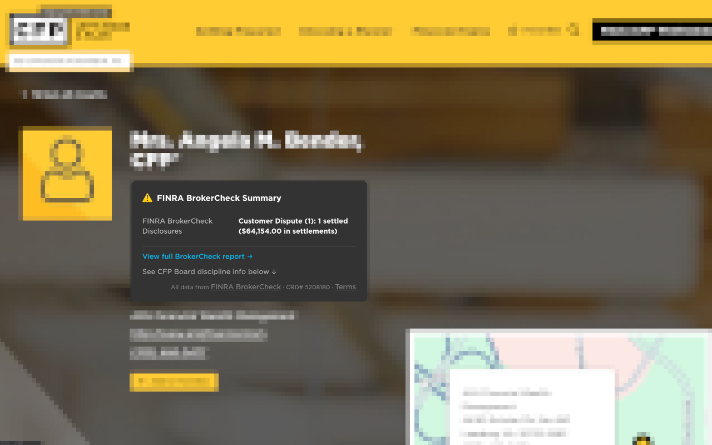

# Planner Lens

A browser extension that surfaces FINRA BrokerCheck disclosure data while you browse financial planner profiles on LetsMakeAPlan.org.

## What it does

When you visit a CFP® professional's profile on LetsMakeAPlan.org, Planner Lens:

1. Extracts the CRD number from the page's existing BrokerCheck link (deterministic, no fuzzy name matching)
2. Queries FINRA's public BrokerCheck API for disclosure details
3. Displays a prominent badge showing the disclosure count
4. Links directly to the full BrokerCheck report

## Why

LetsMakeAPlan.org buries disclosure information at the bottom of each profile. The data is technically there, but most consumers never scroll that far. Planner Lens makes that information immediately visible so you can make informed decisions before engaging a planner.

## Install

### Firefox
[Install from Firefox Add-ons](https://addons.mozilla.org/en-US/firefox/addon/planner-lens/)

### Chrome
Pending approval on [Chrome Web Store](https://chromewebstore.google.com/)

### Userscript (Greasemonkey / Tampermonkey)
If you already run a userscript manager, you can skip the extension entirely:

1. Install [Tampermonkey](https://www.tampermonkey.net/) or [Greasemonkey](https://www.greasespot.net/)
2. Open [`userscript/planner-lens.user.js`](userscript/planner-lens.user.js) on GitHub and click "Raw"
3. Your userscript manager will prompt you to install it

Same functionality, same visual output, no store required.

### From source (development)
1. Clone this repo
2. **Firefox:** Open `about:debugging` > "This Firefox" > "Load Temporary Add-on" > select `src/manifest.json`
3. **Chrome:** Open `chrome://extensions` > Enable "Developer mode" > "Load unpacked" > select `src/`

## Architecture

- **Manifest V3** single codebase targeting both Chrome and Firefox
- **Content script** fires on `letsmakeaplan.org/find-a-cfp-professional/certified-professional-profile/*`
- **CRD-based matching** extracts the CRD number from the page's own BrokerCheck link (no name guessing)
- **No backend** required. Queries BrokerCheck's public detail API directly from the browser.
- **No data storage.** All lookups are real-time with nothing cached.

## Legal basis

FINRA's [BrokerCheck Permitted Uses](https://www.finra.org/investors/investing/working-with-investment-professional/about-brokercheck/permitted-uses) explicitly allows copying and compiling BrokerCheck data for investor protection purposes, including redistribution with attribution.

## Disclaimer

Planner Lens is an independent project. It is not affiliated with, endorsed by, or associated with the CFP Board, LetsMakeAPlan.org, or FINRA. "CFP" and "CERTIFIED FINANCIAL PLANNER" are trademarks of the Certified Financial Planner Board of Standards, Inc. "BrokerCheck" is a trademark of the Financial Industry Regulatory Authority, Inc.

This extension queries publicly available data from FINRA BrokerCheck and presents it alongside LetsMakeAPlan.org profiles for consumer convenience. It does not modify, scrape, or republish data from LetsMakeAPlan.org.

## License

MIT
